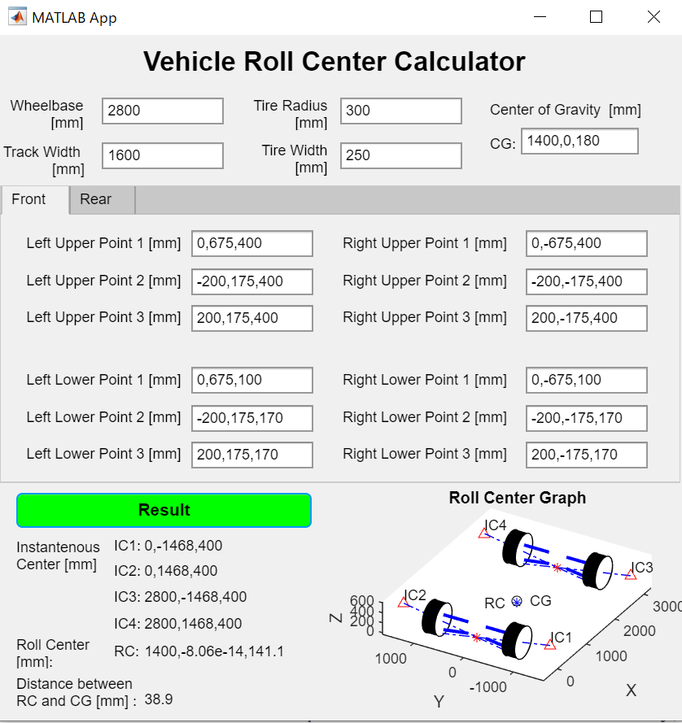
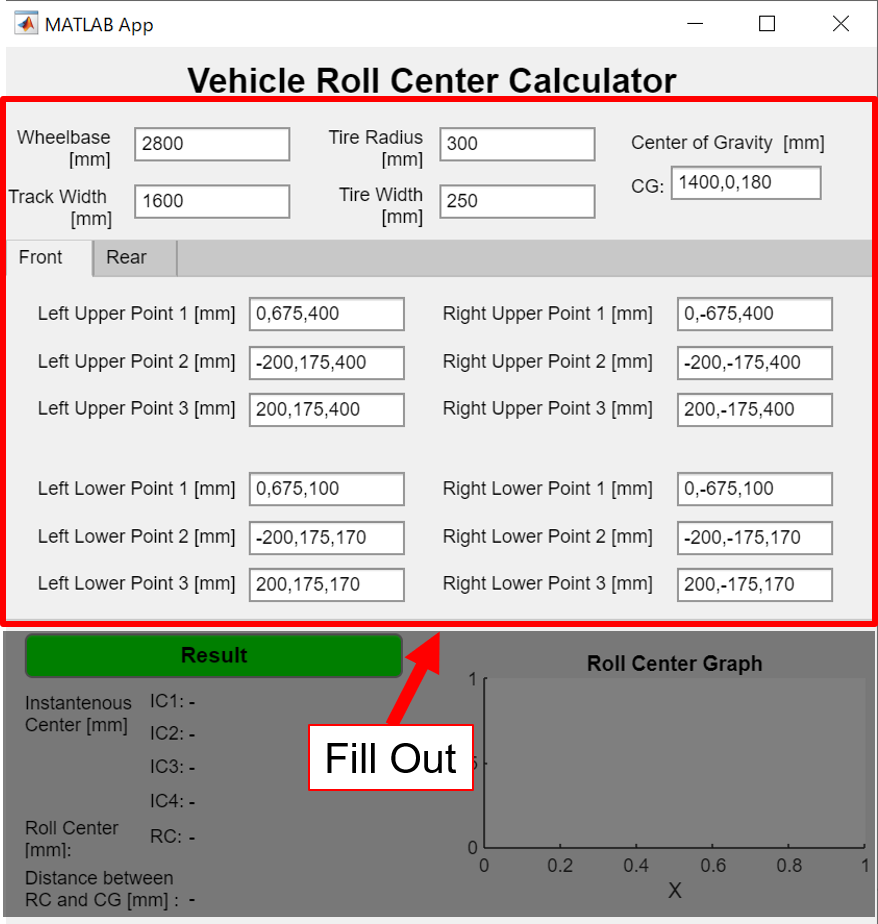
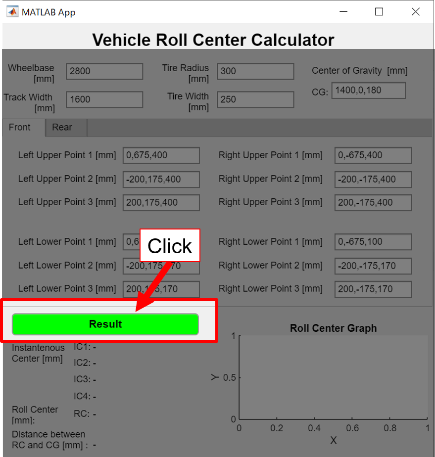
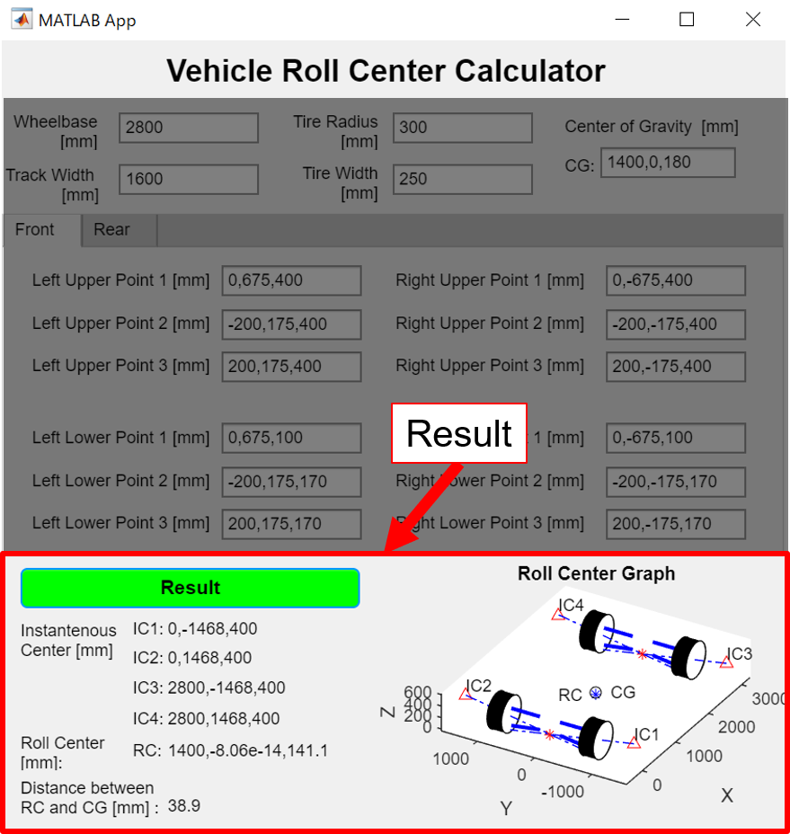
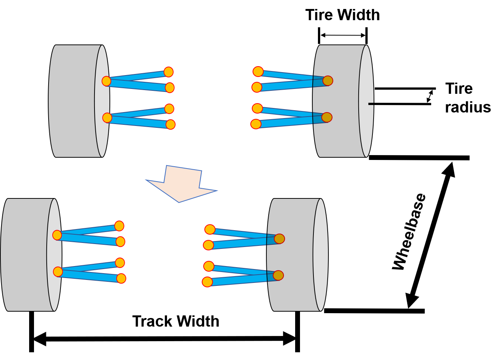
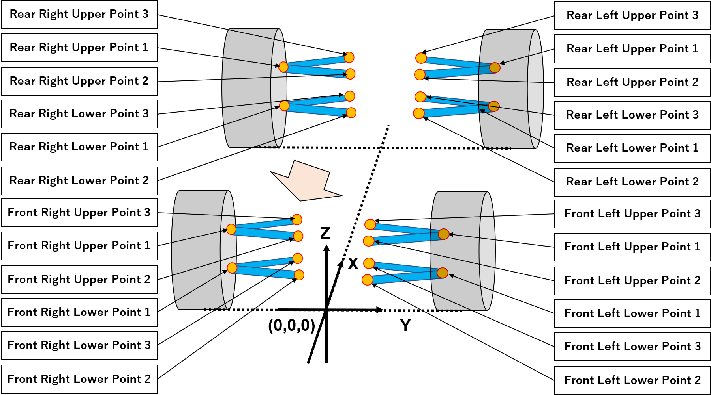
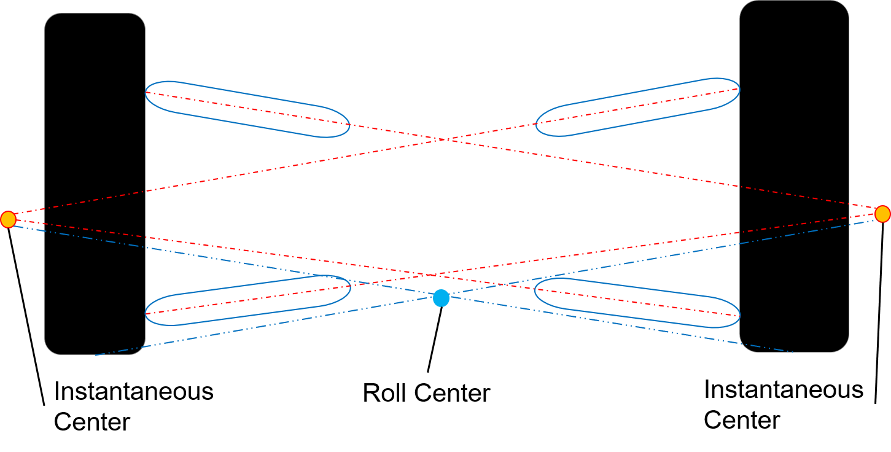

# Roll Center Calculator

About the submission:

This submission contains a set of the .mlapp file and the .m function files to calculate the roll-center height. The model is built for the student teams participating in the automotive competitions. The teams can use this app as a reference to find the better connecting position of their suspension by checking the distance between the roll center position and the center of gravity.

## Roll Center Point depends on suspension geometry

## How to use the app?

### 1.Fill out inputs in the app

### 2.Click "Result Button"

### 3.Check the Result

## What are the Inputs
・Center of gravity position

・Tire information including tire radius, width, track, and wheelbase

・XYZ coordinates of pickup point between the suspension and vehicle body or wheel

## What are the Outputs
・Instantaneous center position
・Roll center position

・Distance between Roll center height and Center of gravity height
・A graphic image

## Product Requirements

The models are developed in MATLAB R2020b version and use the following MathWorks products:
1. [MATLAB](https://www.mathworks.com/products/matlab.html)

## Learning Resources
Once the app has been published on GitHub/FEX, we will record the video to explain the concepts and workflow of the app.

## Reference
William, F. M.(1995).Race Car Vehicle Dynamics. Society of Automotive Engineers

Copyright 2020 The MathWorks, Inc.
